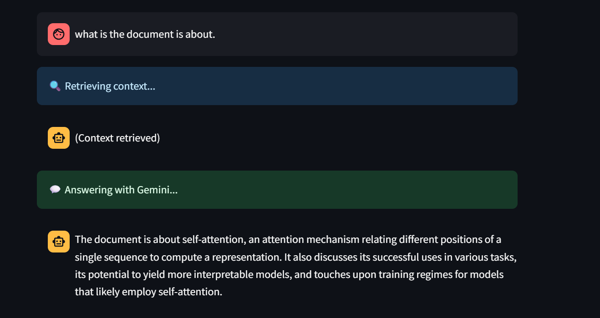

# 🤖 Gemini RAG PDF Q&A (Tool Calling)



A **Retrieval-Augmented Generation (RAG)** application using **Google's Gemini** model to answer questions from uploaded PDFs. Built with **LangChain Tools**, **FAISS**, **SentenceTransformers**, and **Streamlit**, this project showcases a full RAG pipeline integrated with Gemini via tool-calling style.

---

## 🚀 Features

- 📄 Upload any PDF
- 🧩 Automatically splits and chunks text
- 🧠 Embeds chunks using MiniLM and stores in FAISS index
- 🔍 Retrieves top-k relevant chunks based on your query
- 💬 Uses **Gemini Pro** to generate answers based on retrieved context

---

## 📸 Demo

>   
> *Above: Screenshot of the app answering a question based on a PDF.*

---

## 🛠️ How It Works

### 1. **Load PDF**
Uses `PyPDFLoader` to extract content.

### 2. **Chunking**
Splits the content using `RecursiveCharacterTextSplitter`.

### 3. **Embedding**
Generates embeddings using `sentence-transformers/all-MiniLM-L6-v2`.

### 4. **Vector Store**
Stores embeddings in a `FAISS` index for efficient retrieval.

### 5. **Query + Gemini Answering**
Top chunks are retrieved and passed into **Gemini Pro** to generate answers.

---

## 🔧 Tech Stack

- [LangChain](https://www.langchain.com/)
- [Gemini API (Google Generative AI)](https://ai.google.dev/)
- [Streamlit](https://streamlit.io/)
- [FAISS](https://github.com/facebookresearch/faiss)
- [Sentence Transformers](https://www.sbert.net/)
- Python 3.10+

---

## 📦 Setup Instructions

### 1. Clone this Repo

```bash
git clone https://github.com/your-username/your-repo-name.git
cd your-repo-name
